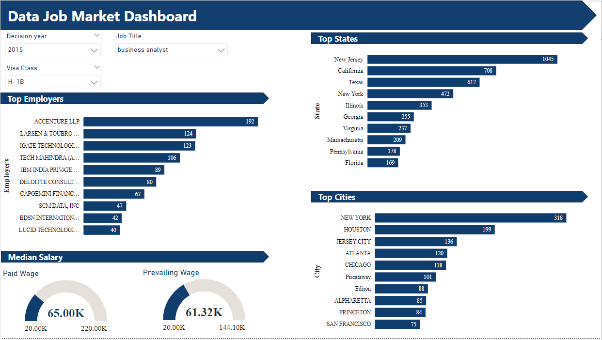

# Data-Job-Market Dashboard

## Overview

The Data Job Market Dashboard is a visual analytics project built using Power BI to analyze trends and insights in the data job market. The dashboard provides an interactive interface to explore leading employers, top states, top cities, and median salary trends for data-related jobs from 2011 to 2015.

## Key Features

- **Leading Employers Analysis:** Explore the leading employers in the data job market from 2011 to 2015 using a stacked bar chart.

- **Top States and Cities:** Visualize the top states and cities for data-related jobs using interactive visualizations.

- **Median Salary Trends:** Utilize a gauge chart to showcase the median salary trends for actual and prevailing wages.

- **Interactive Dropdown Slicers:** Utilize three dropdown slicers for selecting years, job titles (Data Analyst, Business Analyst, Software Engineer, and Data Scientist), and visa classes (H1-B1, H1-B1 Chile, H1-B1 Singapore, Green Card, E3 Australia) to filter and drill down the data.

## Data Description

The dashboard utilizes a dataset containing information such as case number, case status, case received date, decision date, employer name, prevailing wage, paid wage, job title, work city, education level required, experience required, country of citizenship, prevailing wage SOC code and title, work state, full-time position status, visa class, and additional relevant fields.

## Usage Instructions

- **Download Power BI File:** Download the Power BI (.pbix) file from the GitHub repository.

- **Open Power BI Desktop:** Open the downloaded file in Power BI Desktop.

- **Explore Dashboard:** Interact with the dashboard using dropdown slicers to filter data based on years, job titles, and visa classes.

- **Analyze Insights:** Explore leading employers, top states, top cities, and median salary trends for data-related jobs.

## Future Enhancements
- Incorporate additional data sources to provide deeper insights into the data job market.
- Implement advanced analytics techniques for predictive analysis and forecasting.
- Enhance user interactivity and customization options within the dashboard.

